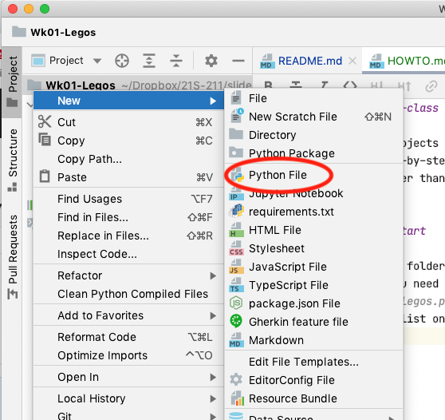

# HOWTO for in-class exercise week 1

Most of our projects will have a how-to like this to 
guide you step-by-step through working the project.  This
HOWTO is simpler than those, but we will follow the same
model. 

## Getting a start

In the project folder, create a file `legos.py`.
The command you need is `new` and then `Python file`, 
then specify `legos.py` as the file name.  It should 
appear in the list on the left. 



## Some starter code

I won't generally provide this much code to copy as one chunk,
but the instructions often include small chunks of code that you
can copy into your project.  

*BUT ...*

Even if you can copy the code, that doesn't mean that you should
must paste it in without understanding what it does!  If you 
paste without bothering to understand a block of code, you are likely
later to reach something that you can't figure out.  

We'll start here with some code from Tuesday. 

First we created a class `LegoBlock`. 

```python
class LegoBlock:

    def __init__(self, color: str):
        self.block_color = color

    def repaint(self, new_color: str):
        self.block_color = new_color
```

Let's make our `LegoBlock`s for today a little bit fancier ...
we can give them a size (just an integer indicating the number
of square units they cover) as well as a color.  While we can
repaint a block to change its color, its size will be fixed. 

When you are done adding a `size` argument to the constructor,
we should be able to create a Lego block like this: 

```python
block = LegoBlock("orange", 2)
```

But if we create a block and print it, the output is pretty 
unsatisfying: 

```commandline
<__main__.LegoBlock object at 0x10d751fd0>
```

Let's fix that by adding some "magic methods".  `print(x)` 
automatically calls `str(x)`, and `str(x)` actually calls 
`x.__str__()`, so we can add a `__str__` method to `LegoBlock`
to make it prettier: 

```python
    def __str__(self) -> str:
        return f"{self.block_color} block of size {self.size}"
```

Now we'll get a better output: 

```commandline
orange block of size 2
```

We can write a little dummy main program to check out the code
so far: 

```python
def main():
    orange_block = LegoBlock("orange", 2)
    print(orange_block)

if __name__ == "__main__":
    main()
```

Try executing the code! 

## A bucket

Now that we can make Lego blocks, it is clear that we will 
need a box to keep them in.  We can start with the box
we built Tuesday.   

First, we imported something to let us give a more precise type
contract for a list of `LegoBlock` objects. 

```python
from typing import List
```

This lets us specify that our box only contains Legos and not Duplo or 
Tinkertoys. 

```python
class LegoBox:
    def __init__(self):
        self.my_blocks: List[LegoBlock] = []

    def put_away(self, block: LegoBlock):
        self.my_blocks.append(block)
```

We have the same issue with printing LegoBlock objects, as we can 
see if we do so in our `main` function: 

```python
def main():
    orange_block = LegoBlock("orange", 2)
    print(orange_block)
    blue_block = LegoBlock("blue", 3)
    box = LegoBox()
    box.put_away(orange_block)
    box.put_away(blue_block)
    print(box)
```

This produces

```commandline
orange block of size 2
<__main__.LegoBox object at 0x10886d460>
```

But we know what to do ... we'll add a "magic" string method to 
`LegoBox`: 

```python
    def __str__(self) -> str:
        return str(self.my_blocks)
```

Seems reasonable ... but here's what we get now: 

```commandline
orange block of size 2
[<__main__.LegoBlock object at 0x10e4bdfd0>, <__main__.LegoBlock object at 0x10e4bd520>]
```

What happened?  It turns out the `__str__` method for lists does not
call the `str` function on each list element, but rather a related 
method `__repr__` (for "representation").  Why?  I don't know!  But 
since it does, we can improve it by adding a magic method `__repr__` 
to the `LegoBlock` class. 

The convention in Python is that, where practical, a `__repr__` method
should produce a string that "looks like" a call to the constructor
for that class.  So ... 

```python
    def __repr__(self) -> str:
        return f"LegoBlock({self.block_color}, {self.size})"
```

And now if we run the program again, we at last have something 
reasonable: 

```commandline
orange block of size 2
[LegoBlock(orange, 2), LegoBlock(blue, 3)]
```

## Challenge: Self-sorting boxes

Now we have Lego blocks of various shapes and sizes, and we have boxes
that we can put blocks away in. These are rather old-fashioned boxes
in which we can manually place blocks, but if you have ever used 
Lego blocks, you know it can be quite difficult to find just the block
you need to finish your star cruiser.  Let's add some automation! 

Here's what I want: After I put a bunch of blocks into one box, I want
to be able to automatically transfer all boxes of a particular size
into a second box.  The new method will be called `select` and 
will have this header: 

```python
    def select(self, other: "LegoBox", size: int):
```

The quotes around `LegoBox` are required because this method is within
the `LegoBox` class definition, so from Python's perspective the 
`LegoBox` class does not exist (has not been completed) yet.  This
method does not return a value (no `-> someType`), so we can infer that
it likely modifies the `self` object, but we'll give it a docstring to
be clear. 

```python
    def select(self, other: "LegoBox", size: int):
        """Remove blocks of selected size and place them in other"""
```

We can check this new functionality with a modified `main` function: 

```python
def main():
    orange_block = LegoBlock("orange", 2)
    blue_block = LegoBlock("blue", 3)
    green_block = LegoBlock("green", 2)
    box = LegoBox()
    box.put_away(orange_block)
    box.put_away(blue_block)
    box.put_away(green_block)
    print(f"Before selecting: {box}")
    selection = LegoBox()
    box.select(selection, 2)
    print(f"Big box: {box}")
    print(f"Selection box: {selection}")
```

If we implemented the `select` method correctly, we should get this 
output: 

```commandline
Before selecting: [LegoBlock(orange, 2), LegoBlock(blue, 3), LegoBlock(green, 2)]
Big box: [LegoBlock(blue, 3)]
Selection box: [LegoBlock(orange, 2), LegoBlock(green, 2)]
```
