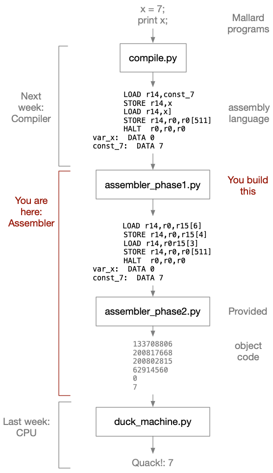

# The Duck Machine Assembler

An assembler translates human-readable and writeable assembly 
language into binary machine code.  Each line of the 
assembly code generally represents a single machine instruction
(except for lines that are just comments, labels, or empty). 

This repository is starter code for a project in CIS 211, 
Introduction to Computer Science II, at University of Oregon. 
The assembler is divided into two phases.  Phase II translates
fully resolved assembly language, with numerical addresses, 
into object code.  Phase I translates assembly code with 
symbolic labels and pseudo-operations like JUMP into the 
fully resolved assembly language format that Phase II can 
process.  Phase II is provided, and students must build Phase I.

The assembler is part of a multi-stage project in which students 
built a CPU simulator, an assembler, and the code generator 
for a compiler.  Together these programs allow us to write 
programs in the Mallard language and execute those programs
on a simulated Duck Machine. 

