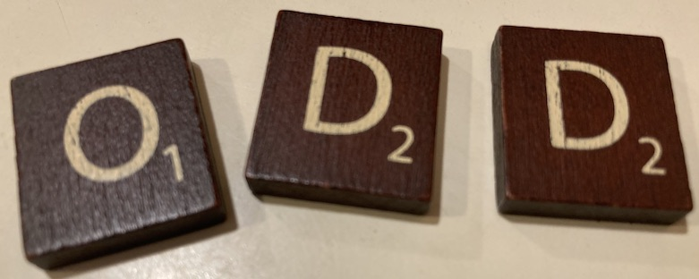
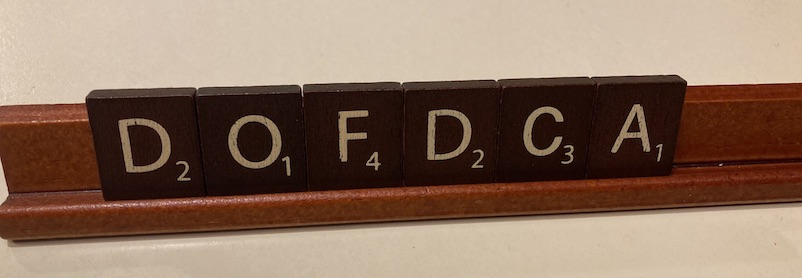

# HOWTO for mini-exam 1, CIS 211 week 2

Scrabble is a word game in which players try to form
English words from tiles that contain letters.  Each 
tile contains a letter and an associated value. 
For example, a tile that holds letter A will always
have value 1, and a tile that holds letter X will 
always have value 8.



## Part 1 (10 points)

Create file `scrabble.py`, which is the file
you will turn in.  The rest of these instructions
are for classes in `scrabble.py`. 

### Class Tile


Create a class Tile. Each tile has two instance variables,
`letter` (a string) and `value` (an integer).  The 
constructor for a `Tile` object should have this header: 

```python
def __init__(self, letter: str, value: int):
```

Although we will not test the `str` and `repr` functions
for `Tile` objects, you may find these helpful for 
debugging: 

```python
    def __str__(self) -> str:
        """Looks like ('X', 8)"""
        return f"('{self.letter}',{self.value})"

    def __repr__(self) -> str:
        """Looks like Tile('X', 8)"""
        return f"Tile('{self.letter}', {self.value})"
```

### Class Tray

A `Tray` holds a collection of scrabble tiles. 



Create a class `Tray` with this constructor: 

```python
    def __init__(self):
        self.tiles = []
```

Create an `add_tile` method for class `Tray`, with
this header: 

```python
    def add_tile(self, tile: Tile):
        """Add tile to the collection of tiles in this tray"""
```

You may find the following magic methods for `str` and `repr`
useful for debugging, although we will not test them: 

```python
    def __str__(self) -> str:
        """Looks like ('A', 1),('X', 8),('E', 1)"""
        return ",".join([str(t) for t in self.tiles])

    def __repr__(self):
        """Looks like Tray(('A', 1),('X', 8),('E', 1))"""
        return f"Tray({str(self)})"
```

Add a method `has` with the following header: 

```python
    def has(self, letter: str) -> bool:
        """Does this tray hold a tile with the specified letter?"""
```
Note that this method does not modify the `Tray` object;
it just returns `True` if the tray currently holds a tile
with the specified letter.  Otherwise it returns `False`. 

## Part 2 (10 points)

So far you have a tray that holds some Scrabble tiles, 
and you can detect whether a tile with a particular letter
is present.  In the second part, we will add a way to
determine how many points we can earn by making a word. 
Suppose the tray `t` holds an A (value 1), an X (value 8), 
and an E (value 1), perhaps mixed together with some other 
tiles. Then `t.would_score("AXE")` should return 10, 
because 1 + 8 + 1 = 10.  (Remember that letters have fixed
values, so even if there are two X in the tray, both will
have value 8.)


But suppose we try 
`t.would_score("AXLE")`, and `t` does not contain a tile with
the letter "L".  The return value should be 0, indicating
that the word "AXLE" cannot be constructed from the tiles
in the tray. 

Note that `would_score` should return an integer value
and *should not* modify the contents of the tray.  

Remember that you can loop through characters in a string
just like you loop through elements of a list. 

I suggest you start by creating a version of method
`Tile.would_score` that works provided the proposed word
does not have any duplicate letters.  For example,
it should work for "AXE" and "AXLE", but not necessarily
for "AJAX", because determining a score for "AJAX" would
require determining whether the tray holds at least two
As.  You can earn up to 8/10 points for this version
of `would_score`.  

If you finish the version that works for words without
duplicate letters, and have time, then try a version
that works even for words like "AJAX" to
earn up to the full 10 points for this part.  
(While the method `has` is useful for the partial credit version,
it probably won't help you with the full version.)  
Be careful; 
keep a copy of your simpler method (just rename it) in case you are not
able to get the more complex version working.  It is *much*
better to turn in code that works for *most* test cases than
code that doesn't work at all!

In `test_scrabble.py`, you will find that class
`Test_Word_Scores_Hard` has test cases for words
with duplicate letters. 

There is more than
one way to make this work.  I implemented 
three different approaches. Here are some 
hints for two of them. 

### Approach 1: Buckets of letters

In this solution approach, we make a dict with
a separate list of tiles for each letter that 
appears in the tray.  We make one loop through
the tiles, adding them to the appropriate list
in the dict.  Then we make a second loop through
the letters of the word, taking tiles from the
lists in the dict and adding the tile 
value to the score. (I used the method `pop` to 
remove a tile from a list.)  We can return 
immediately with score 0 if we don't find a tile
for some letter in the word. 

My implementation of this method was 15 lines of
Python, excluding the method header.  I think it's the
simplest of the three approaches I tried. 

### Approach 2: Nested loops

In this approach, we remove tiles from a copy of
`self.tiles` as we use them.  This requires an outer
loop through the letters of the word, and an inner
loop to find a matching tile.  My implementation of
this approach is 14 lines of Python (slightly shorter
than the approach above), but I think the logic is a
little more complicated.  

* Since you must not modify `self.tiles`, you 
need 
a copy that you can modify.  I did it this way:
```python
    stash = self.tiles.copy()
```

* If you know the index of a tile you want to remove,
one way to remove it is with the `pop` function.  I did
  it this way: 
```python
    stash.pop(tile_i)
```
Be careful not to remove elements from a list *as you
loop through it*, but it is safe to do so when
you have finished the loop (for example, just before
you `break` from it.)

