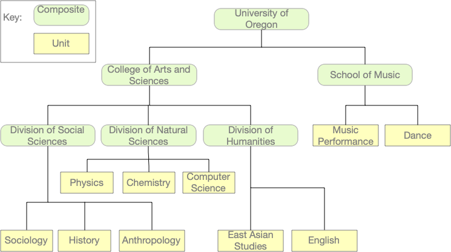
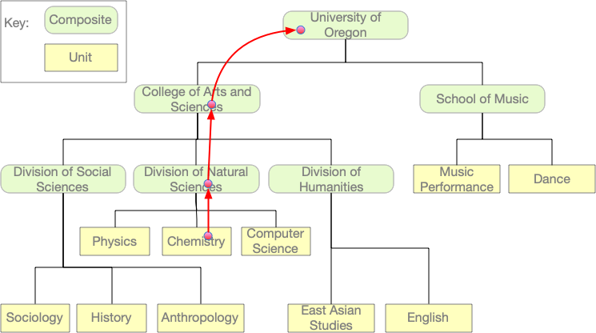
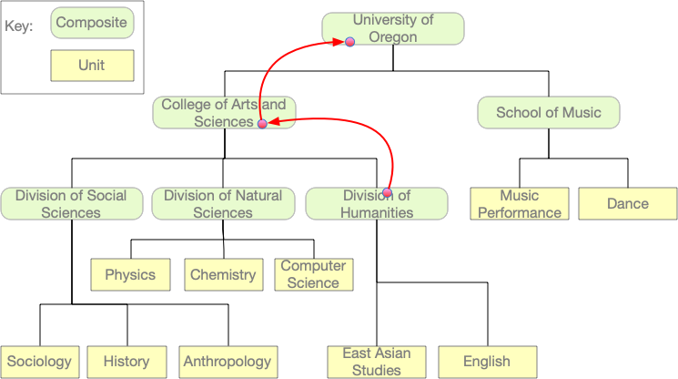

# Mini-exam 3 HOWTO

Universities, businesses, and other organizations 
often have a hierarchical structure.  They can
be represented as trees.

In this mini-exam you will complete a method in two subclasses
of class `Organization`.   You can think of the `Unit` subclass
as leaves of the tree.  The `Composite` class is for parts of
the organization that are divided further, i.e., inner nodes of
the tree.  

Both inner nodes and external nodes in an `Organization` tree
have names.  For example, in an `Organization` representing
the University of Oregon, the College of Arts and Sciences would
be represented by a `Composite` node, with children including
a Division of Natural Sciences, a Division of the Humanities,
and a Division of Social Sciences.  The Division of Natural Sciences
would itself be represented by a `Composite` node, containing the 
Department of
Physics among other departments.  Each department would
represented by a `Unit` node. 



We will assume that the names of organizations are unique. 
For example, we will not permit both the School of Music and the 
College of Arts and Sciences to both have a Department of Statistics. 

Sometimes we want to know how some part of an organization fits
in the whole.  For example, we might ask "where is the 
department of physics", and expect an answer like "the Department
of Physics is in the Division of Natural Sciences, which is 
in the College of Arts and Sciences, which is in
the University of Oregon".  

You will write a `where_is` method to answer such questions.   `org.where_is(name)` will return a list that describes where 
some organization called `name` is within the larger organization
`org`.  For example, suppose we have created the `Organization`
object illustrated above: 

```python
u_oregon = Composite("University of Oregon",
                     [Composite("College of Arts and Sciences",
                                [Composite("Division of Natural Sciences",
                                           [Unit("Department of Physics"),
                                            Unit("Department of Chemistry"),
                                            Unit("Department of Computer Science")]),
                                 Composite("Division of Social Sciences",
                                           [Unit("Department of Anthropology"),
                                            Unit("Department of Sociology"),
                                            Unit("Department of History")]),
                                 Composite("Division of Humanities",
                                           [Unit("Department of English"),
                                            Unit("Department of East Asian Languages")])]),
                      Composite("School of Music",
                                [Unit("Dance Department"),
                                 Unit("Music Performance")])])
```
Now suppose we ask where `"Department of Chemistry"` is within
`u_oregon`:

```python
chem = u_oregon.where_is("Department of Chemistry")
```

We should expect `chem` to be 

```python
["Department of Chemistry", 
 "Division of Natural Sciences",
 "College of Arts and Sciences", 
 "University of Oregon"]
```

We can think of the list returned by `where_is` as a path from
the node with name `"Department of Chemistry"` up through its parent
the root node of the `u_oregon` tree: 



The `where_is` method should also work for composite organizations.
For example, we might ask where the Division of Humanities is within
the University of Oregon organization: 

```python
humanities = u_oregon.where_is("Division of Humanities")
```

We expect the result should be 

```python
["Division of Humanities", 
"College of Arts and Sciences", 
 "University of Oregon"]
```



What if we ask where the Department of Astrology is, but 
University of Oregon for some reason does not have such a 
department?

```python
astrology = u_oregon.where_is("Department of Astrology")
```
We will use an empty list to indicate that there is no
Department of Astrology: 

```python
assert astrology == []
```

## Hints for solving

As in any recursive problem, we need to consider one or more
base cases and one or more recursive cases.  In object-oriented
programming with classes and objects, typically the recursive
cases are handled by some subclasses (typically internal
nodes of a tree structure) and the base 
cases are handled by others (typically leaf nodes). 

### Step 1: Find a Unit

Initially we will only considering looking for `Unit`
objects (departments and programs) in the organization
tree.  Instead of returning a whole path from the
unit to the root of the tree, if we are looking for
a unit with name "Paleontology", we will return either
`["Paleontology"]` if there is such an unit, or
`[]` if there is no such unit in the organization.

There are two base cases for this version of the problem: 
Either a `Unit` object has the name we are looking for, 
or it does not.  

The recursive case will be handled by the `Composite` class.
It must check whether any of its parts contains a matching
unit, by making a recursive call on each part in turn.  If
any of them do contain a matching unit, it can return the same
list that the part returned.  If none of them contain
the matching unit, it can return the empty list. 

At this stage, `u_oregon.where_is("Department of Chemistry")`
should return `["Department of Chemistry"]`, but 
`u_oregon.where_is("Department of Astrology")` should
return `[]`. 

You can earn up to 10 points (out of 20) 
for getting this much working. 

### Step 2:  Composites can match

Typically we encounter base cases only in the leaves of a
a tree, but this problem is slightly unusual:  We might be
looking for a composite unit like "School of Music". 
The `where_is` method of `Composite` should therefore handle
this base case before checking each of its parts.  If we
were looking for "School of Music", we don't need to check
on the "Music Performance" and "Dance Department" units. 

At this stage, `u_oregon.where_is("Division of Natural Sciences")`  should return `["Division of Natural Sciences"]`.  

You can earn up to 13 points for getting this much working. 

### Step 3: Composing the Path

If you have succeeded with the two steps above, what remains
is to compose the list of organization names in the
recursive step.   The `where_is` method of the `Composite`
class will still make a recursive call on each of its parts
(`self._parts`) to determine whether that part contains the
organization it is looking for. But now, when one of the parts
returns a non-empty list, the `Composite` should add its own
name to the list before returning it. 

When you get this part working, you should be able to pass the tests
in `test_university.py` and you can earn up to the full 20 points
for this mini-exam. 


